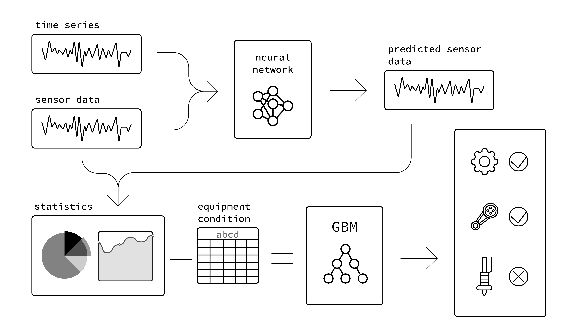

# Predictive maintenance
Breakdown analisys based on sensors data

## Data
One awesome [dataset](https://www.kaggle.com/yuansaijie0604/xinjiang-pm) from Kaggle

### Description
+ **Failure history**: The failure history of a machine or component within the machine.
+ **Maintenance history**: The repair history of a machine, for example, error codes, previous maintenance activities, or component replacement.
+ **Conditions and use of machines**: The operating conditions of a machine, for example, data collected from sensors.
+ **Machine characteristics**: The characteristics of a machine, for example, engine size, make and model, age.
+ **Telemetry**: time series data with *voltage, rotation, pressure and vibration* measurements collected from 100 machines in real time-averaged over each hour collected during the year 2015.

### Goal
The goal is to predict a breakdown in the next 3 days (*failure* data)

## Model
1. **LSTM RNN** ([Pytorch](https://pytorch.org/)) for time series processing
2. **Gradient Boosting** ([CatBoost](https://catboost.ai/)) for statistics analysis and prediction



## Installing
Run the following command in the console
```bash
conda env create -f environment.yml
```

And download data
1. Login to Kaggle and download [archive](https://www.kaggle.com/yuansaijie0604/xinjiang-pm/download)
2. Extract files into `./date/` in the project root

## Training models
+ Train RNN for time series prediction

   ```bash
   python train_lstm.py --max_epochs 10 --learning_rate 0.001
   ```

+ Train CatBoost Classifire for failure prediction
   ```bash
   python train_gbm.py --n_iterations 10000
   ```

## Testing
Loading models from chekpoints and testing
```bash
python test.py --machine_id 13
```